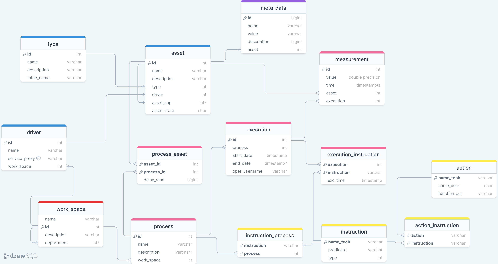

# System for managing Industry 4.0 assets.

System that be able manage the IIoT assets and the data generate for these infrastucture.  


## Installation

### Pre-requirements

1. **Apache Artemis.**

    if you dont have any artemis version, you can running broker.sh for linux or broker.cmd in windows.

    ```bash
    ./broker.sh
    ```
    In windows you'll need running cmd console like administrator.
    ```bash
    broker.cmd
    ```
    * options:
        * broker.sh : install and start artemis broker.
        * broker.sh stop: stop service.
        * broker.sh start: start service.
        * broker.sh uninstall: uninstall artemis broker.
    <br>    

2. **Postgres database.**
    <br>    

    you need install postgres database, for that you can visit <a href="https://www.postgresql.org/download/">oficial page for downloads.</a> 
    <br>

    **Nota:** *Remember modify "pg_hba.conf" file, add a line to enable access to the hosts where you will be deploying. **Restart postgres service.***
    <br>

    when you have postgres installed, run follow scrips:

    * [user ddl](../scriptsSQL/user-db.sql)
    * [database ddl](../scriptsSQL/model.sql)
    * [database inserts](../scriptsSQL/model_inserts.sql)

    you can use psql like this, run commands in the script's folder.

    ```bash
    psql -U postgres -h {host} -c "\i user-db.sql"
    psql -U ingswi40 -h {host} -d assets -c "\i model.sql"
    psql -U ingswi40 -h {host} -d assets -c "\i model_ddl.sql"
    ```
    <br>    

3. **Java**.
    <br>    

    you need install java jdk 11 LTS, for that you can visit <a href="https://www.oracle.com/co/java/technologies/downloads/">oficial page for downloads.</a>
    <br>    

4. **ICE: Internet communication engine.**<br>
    This system used ICE middleware for communications. This middleware enables easy remote procedure calls. more information about ICE <a href="https://zeroc.com/products/ice">here.</a>    <br>
    you need install ICE compiler for java, for that you can visit <a href="https://zeroc.com/downloads/ice/3.7/java">oficial page for downloads.</a> 
    <br>    
5. **Gradle.**    <br>        
    you need install gradle version 7.*, for that you can visit <a href="https://gradle.org/install/">oficial page for downloads.</a>

    Also you can use gradlew script into folder.

### System specifications.

1. **Database schema.**

    
 
### Build and deployment.

Before build artifacts rewiew next properties.

- [plcDriver.properties](./plcDriver/src/main/resources/application.properties)
    ```properties
    driver.asset.Endpoints = tcp -h * -p 5431
    driver.asset.threadpool.size = 5
    ```

- [managerServer.properties](./managerServer/src/main/resources/application.properties)

    ```properties
    Model.Endpoints = tcp -h * -p 12345
    mqtt.host=localhost
    database.url=jdbc:postgresql://localhost:5432/assets
    database.schema=asset_manager
    database.user=ingswi40
    database.password=IngSwI40PWD
    ```

When you have verified thar properties are right, run:

* Local
    ```bash
    gradle clean
    gradle :plcDriver:run
    ```
    open new terminal.
    ```bash
    gradle :managerServer:run
    ```
* Remote

    To deploy in a distributed environment, the following must be done: 

    * [build.gradle](build.gradle)
    ```gradle
    remotes {
        hgrid19 {
            role 'plcDriver'
            host = 'xhgrid19'
            user = project.property("plcDriver.user")
            password = project.property("plcDriver.password")
        }
        hgrid20 {
            role 'managerServer'
            host = 'xhgrid20'
            user = project.property("managerServer.user")
            password = project.property("managerServer.password")
        }
    }
    ```
    * [gralde.properties](gradle.properties)
    ```properties
    plcDriver.user=swarch
    plcDriver.password=swarch

    managerServer.user=swarch
    managerServer.password=swarch
    ```
    * [managerServer prod.properties](./managerServer/src/main/resources/prod.properties)
    ```properties
    Model.Endpoints = tcp -h * -p 12345
    mqtt.host=remoteArtemis
    database.url=jdbc:postgresql://remoteHost:5432/assets
    database.schema=asset_manager
    database.user=ingswi40
    database.password=IngSwI40PWD
    ```
    Change properties values as appropiate, finally run:

    ```bash
    gradle :plcDriver:deploy -Denv=prod
    gradle :managerServer:deploy -Denv=prod
    ```

    Also you can use gradlew script into folder.

### Usage.

To verify system deployment, you can use command-line interface (CLI) utilities like this

```bash
gradle :CLI:build
java -jar CLI/build/libs/CLI.jar
```
Alternatively, if the managerServer is deployed on a remote host, you can specify the hostname or IP address of the remote host instead of using "localhost".

```bash
java -jar CLI/build/libs/CLI.jar -h remoteHost
```
For more information about CLI usage go to [here](./CLI/Readme.md)