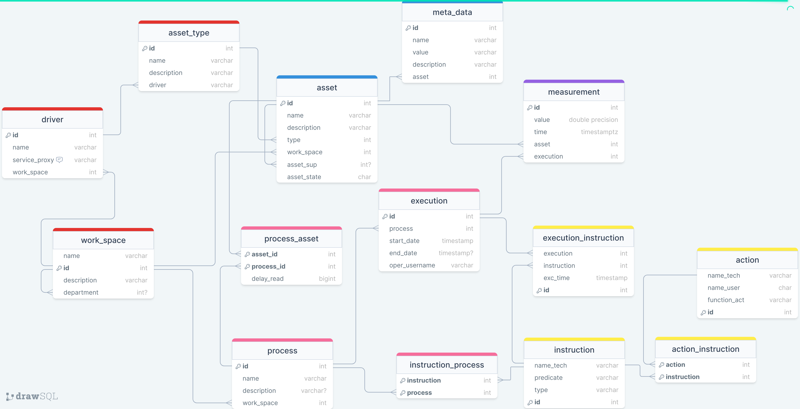
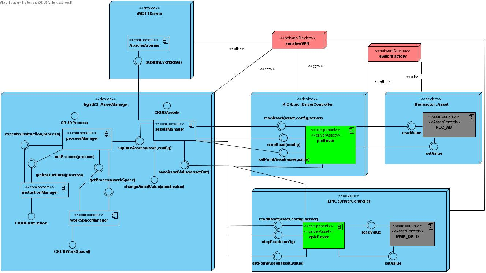

# System for managing Industry 4.0 assets.

System that be able manage the IIoT assets and the data generate for these infrastucture.  

## System specifications.

1. **Database schema.**

    

2. **Deployment diagram**

    
    
## Installation

### Pre-requirements

1. **Apache Artemis.**

    If you dont have any artemis version, you can running ***broker.sh*** for linux or ***broker.cmd*** in windows, these scripts are in [scripts folder](./Code/java/scripts). In order to run these scripts, you should have the **unzip** and **wget** commands available in your system.

    ```bash
    ./broker.sh
    ```
    In Windows, you will need to run the Command Prompt (CMD) console as an administrator. This will grant you the necessary permissions to execute certain commands or perform system-level actions.

    ```bash
    broker.cmd
    ```
    * options:
        * broker.sh : install and start artemis broker.
        * broker.sh stop: stop service.
        * broker.sh start: start service.
        * broker.sh uninstall: uninstall artemis broker.
    <br>    

2. **Postgres database.**
    <br>    

    you need install postgres database, for that you can visit <a href="https://www.postgresql.org/download/">oficial page for downloads.</a> 
    <br>

    **Note:** *Remember modify "pg_hba.conf" file, add a line to enable access to the hosts where you will be deploying. **Restart postgres service.***
    <br>

    when you have postgres installed, run follow scrips:

    * [user ddl](./Code/scriptsSQL/user-db.sql)
    * [database ddl](./Code/scriptsSQL/model.sql)
    * [database inserts](./Code/scriptsSQL/model_inserts.sql)

    you can use psql like this, run commands in the script's folder.

    ```bash
    psql -U postgres -h {host} -c "\i user-db.sql"
    psql -U ingswi40 -h {host} -d assets -c "\i model.sql"
    psql -U ingswi40 -h {host} -d assets -c "\i model_inserts.sql"
    ```
    <br>    

3. **Java**.
    <br>    

    you need install java jdk 11 LTS, for that you can visit <a href="https://www.oracle.com/co/java/technologies/downloads/">oficial page for downloads.</a>
    <br>    

4. **ICE: Internet communication engine.**
    <br>

    This system used ICE middleware for communications. This middleware enables easy remote procedure calls. more information about ICE <a href="https://zeroc.com/products/ice">here.</a>    <br>
    you need install ICE compiler for java, for that you can visit <a href="https://zeroc.com/downloads/ice/3.7/java">oficial page for downloads.</a> 
    <br>    
5. **Gradle.**    <br>        
    you need install gradle version 7.*, for that you can visit <a href="https://gradle.org/install/">oficial page for downloads.</a>

    Also you can use gradlew script into folder.

### Build and deployment.
<br>

For this example, we are deploying a driver called [plcDriver](./Code/java/plcDriver/ReadME.md) that allows reading and writing tags from Allen-Bradley PLCs. 

If you don't have a PLC available, you can use the [dummyDriver](./Code/java/dummyDriver) instead. The **dummyDriver** generates random numbers for the PLC's tags, allowing you to simulate PLC behavior without an actual PLC device.

On the other hand, if you wish to develop your own custom driver, you can refer to the [Driver Asset](./Code/java/driverAsset/ReadME.md) for guidance and reference. The *Driver Asset* provides information and resources to help you create a custom driver tailored to your specific needs.

Whether you choose to use the "dummyDriver" or develop your own custom driver, both options offer flexibility and the ability to interact with the system.


Before building the artifacts, please review the following properties:

- [plcDriver.properties](./Code/java/plcDriver/src/main/resources/application.properties)
    ```properties
    driver.asset.Endpoints = tcp -h * -p 1804
    driver.asset.threadpool.size = 5
    ```

- [managerServer.properties](./Code/java/managerServer/src/main/resources/application.properties)

    ```properties
    Model.Endpoints = tcp -h * -p 1704
    mqtt.host=localhost
    database.url=jdbc:postgresql://localhost:5432/assets
    database.schema=asset_manager
    database.user=ingswi40
    database.password=IngSwI40PWD
    ```

    **Note:** *The default ports for the system are 1804 for drivers and 1704 for managerServer. Before proceeding, please verify that the system firewall allows traffic for these ports.*

When you have verified thar properties are right, go to [source folder](./Code/java), open a new terminal and run:

* Local
    ```bash
    gradle clean
    gradle :plcDriver:run
    ```
    open new terminal.
    ```bash
    gradle :managerServer:run
    ```
* Remote

    To deploy in a distributed environment, the following must be done: 

    * [build.gradle](./Code/java/build.gradle)
    ```gradle
    remotes {
        hgrid19 {
            role 'plcDriver'
            host = 'xhgrid19'
            user = project.property("plcDriver.user")
            password = project.property("plcDriver.password")
        }
        hgrid20 {
            role 'managerServer'
            host = 'xhgrid20'
            user = project.property("managerServer.user")
            password = project.property("managerServer.password")
        }
    }
    ```
    * [gralde.properties](./Code/java/gradle.properties)
    ```properties
    plcDriver.user=
    plcDriver.password=

    managerServer.user=
    managerServer.password=
    ```
    **if these file doesn't exist, make it.**

    * [managerServer prod.properties](./Code/java/managerServer/src/main/resources/prod.properties)
    ```properties
    Model.Endpoints = tcp -h * -p 1704
    mqtt.host=remoteArtemis
    database.url=jdbc:postgresql://remoteHost:5432/assets
    database.schema=asset_manager
    database.user=ingswi40
    database.password=IngSwI40PWD
    ```
    Change properties values as appropiate, finally run:

    ```bash
    gradle :plcDriver:deploy
    gradle :managerServer:deploy -Denv=prod
    ```

Also you can use gradlew script into folder.

### Usage.
<br>

To verify system deployment, you can use command-line interface (CLI) utilities like this

- Build:
    ```bash
    gradle :CLI:build
    ```
- Run localhost
    ```bash
    java -jar CLI/build/libs/CLI.jar
    ```
- Run remote administration

    Alternatively, if the managerServer is deployed on a remote host, you can specify the hostname or IP address of the remote host instead of using "localhost".

    ```bash
    java -jar CLI/build/libs/CLI.jar -h remoteHost
    ```
For more information about CLI usage go to [here](./Code/java/CLI/Readme.md)